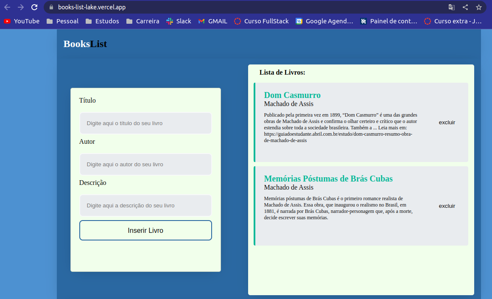

<h1 align="center">Projeto BooksList</h1>

## Sobre

Aplicação criada para teste técnico de vaga para desenvolvedor React Jr.

Plataforma de inserção e deleção de livros .
Você poderá conferir a aplicação através da seguinte URL https://books-list-lake.vercel.app/

<div align="center">


</div> <br>

<p align="center">
</img>
</img>
</img>
</img>
</img>

</p>

## Tecnologias Usadas 🛠️

- [Vite](https://vitejs.dev)
- [React](https://react.dev/)
- [Typescript](https://www.typescriptlang.org/)
- [Styled Components](https://styled-components.com/)
- [Zod](https://zod.dev/)
- [UUID](https://www.npmjs.com/package/uuid)

## Estrutura do Projeto 📂

```
├── src
│ ├── assets
│ ├── components
│ ├── pages
│ ├── styles
│ ├── App.jsx
│ └── main.jsx
├── .gitignore
├── index.html
├── .GUIDE.md
├── package-lock.json
├── package.json
├── README.md
└── vite.config.js
```

## 💛

<br>
